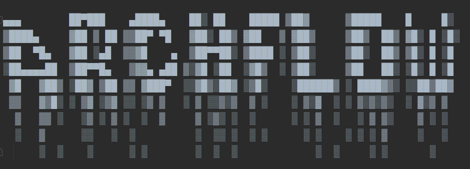

---------------------------------------------------------------------------------------------------------------

### ArchFlow (Architecture Flow)

### Tool for a Data Architecture Stress-Test and Dataflow Simulation using ABMs (Agent Based Modeling)

1) Why this Font?
    - If you leave it ON, your device will drip a molten metal (after I code the simulation part)

2) Why this project?
    - Master's Thesis.

   ```text
    "Markov Chain-Enhanced Integrated ABM (Agent Based Modeling)
    for Predictive Scaling, Bottleneck/edge-case detection in
    Distributed (BigData) Systems (Microservice Architectures)."
    ```

---

#### Goal of this project basically here is to prove that mathematical analysis of an architecture is important (?!), rather then relying on a Solutions Architect's or someone's 6'th sense

---

### List of guaranteed features this shi# will have

- Scalability Analysis
- Identifying scalability needs
- Predicting Bottlenecks
- Predicting System Failures
- Visual Analytics Dashboard for data flow
- Network Topology Optimization

P.S <br>
Scalability includes:
    Disk, CPU, RAM, IOPS, TPS, QPS, RPS

### List of features this will have if there'll be enough time
- Visualizing Dynamics of data flow (Like... watching a simulation live like Zipkin (tool))


### ?! List of possible features this shi# might have ?!

- Optimization of Data Flow in Distributed Systems
- Dynamic Load Balancing
- Automated Edge-Case Scenario Generation
